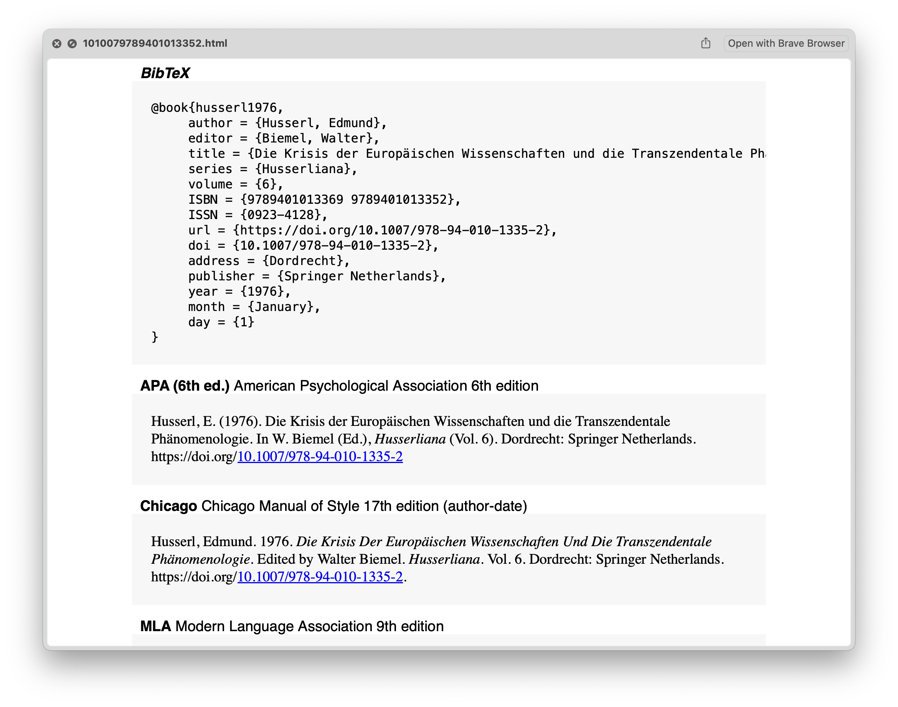

	<h1>
		 
    <i>µ</i>Bib | MicroBib 
    
	</h1>
<i>Citations, BibTeX, and Research</i> 

---

The project combines the APIs of Crossref, Semantic Scholar, OpenAlex, OpenLibrary, Wikipedia, Google Books, and doi.org. Reference metadata is highly inconsistent, incomplete, erroneous or otherwise flawed across different sources. *µ*Bib tries to remedy this by heuristically aggregating information from different sources into one best possible result.

## Core Functions

- Reference lookup using `DOI`, `ISBN`, `PMID`, `PMCID`, `MAG`, `arXiv`, `ACL` identifiers, and URLs (e.g. jstor)
- CSL formatted citations from identifiers and BibTeX
- Free-text search for publication discovery
- Author lookup and publication retrieval
- Ad hoc citation graph traversal
- Lightweight BibTeX reference management and citation picker

## Cheat Sheet

- `ubib <identifier>`
- `ubib <URL>`
- `ubib <free-text>`
- `ubib @article{citekey,...`
- `ubib pmid:<identifier>`
- `ubib pmcid:<identifier>`
- `ubib mag:<identifier>`
- `ubib arxiv:<identifier>`
- `ubib acl:<identifier>`
- `ubib :`
- `ubib ::`
- `ubib :::`, `ubib :c`
- `ubib :b`, `ubib cit`, `ubib lib`
  - bangs: `!a[rticle]`, `!b[ooks]`, `!c[hapter]`, `!o[ther]`

## Documentation

### Metadata retrieval

- Press __⇧__ to Quicklook preview the formatted citations

  
Quicklook Example

  Citation Styles can be configured [within the workflow](https://github.com/zeitlings/ubib#csl-management--maintenance) or the workflow configuration by providing their identifiers. Those can be retrieved via (a) [Zotero](https://www.zotero.org/styles/), or (b) the Citation Style Language [repository](https://github.com/citation-style-language/styles) (alternative: [Github search](https://github.com/search?q=path%3Achicago+repo%3Acitation-style-language%2Fstyles+path%3A*csl+&type=code)).

  

### Publication Discovery

Search is available through Crossref, Semantic Scholar, and OpenAlex. Where available, 
- Crossref allows for traversal of *referenced works* ⌃,
- Semantic Scholar allows for traversal of referenced works and *citing works* ⌥,
- OpenAlex allows for traversal of referenced works, citing works and *related works* ⌥⇧.

| Service          	| Landing-page Preview 	| Abstract 	| TL;DR Digest 	| Open Access 	| Concepts 	| Citation Intent & Context 	|
|------------------	|:--------------------:	|:--------:	|:------------:	|:---------------------:	|:--------:	|:-------------------------:	|
| Crossref         	|           ✔︎          	|     ✔︎    	|              	|                       	|          	|                           	|
| Semantic Scholar 	|           ✔︎          	|     ✔︎    	|       ✔︎      	|           ✔︎           	|          	|             ✔︎             	|
| Open Alex        	|           ✔︎          	|          	|              	|           ✔︎           	|     ✔︎    	|                           	|
|                  	|           ⇧          	|    ⌘+L   	|      ⌘+L     	|           ⌘⇧          	|    ⌘+L   	|            ⌘+L            	|

### Author Discovery & Filtered Search

Besides discovering publications through free-text searches, it's also possible to retrieve works that have been registered under an author's name by looking up the author first (Semantic Scholar and OpenAlex). 

You can refine a Crossref search by filtering the query by the author's name.

The different search modes are accessible through the `ubib :` entry point.

### Reference Management & Citation Picker

You can link your existing bibliography document in the workflow configuration, or select a location where you want to create a new one. New BibTeX references can be quickly added to the library, and managed using the built-in reference manager and citation picker.

While searching the library, you can use `!bangs` to filter by publication type: `!a[rticle]`, `!b[ooks]`, `!c[hapter]`, `!o[ther]`

The subtitle field provides cues about extracted information, such as the presence of an associated abstract, keywords, or document links. These cues are represented using symbols, which may not be visible if the [SF Pro](https://developer.apple.com/fonts/) font is not installed on your device. The information can be viewed in Alfred's large type utility by pressing __⌘+L__.

The citation style corresponding to the pasted *CSL formatted bibliographic reference* can be freely configured.  

> __Note__  
> The BibTeX entries may include a key `dvn`, which is intended to contain the DEVONthink item link to the corresponding document. 

To configure a citation, action the entry while holding down the __⌘__ modifier. To chain multiple citations, use the __⌥__ modifier. The citation picker supports two flavours - __LaTeX__ and __Pandoc Markdown__ - to accomodate various writing scenarios.

### CSL Management & Maintenance

New citation styles are retrieved from the [Zotero](https://www.zotero.org/styles/) repository. When configuring styles manually, the identifier is the last path component of the Zotero URL that resolves to a valid CSL-XML document. For example, the identifier for APA 6th edition is `apa-6th-edition` as in `https://www.zotero.org/styles/apa-6th-edition`.

The display name of a CSL used in the workflow is taken from the short title of the corresponding style sheet. The short title should be declared like this: `<title-short>Display Name</title-short>`. By editing or adding this field, you can influence the appearance. The style sheets can be found in *Data Folder > csl*.

<!--

## Icon Legend

- !todo

-->

<!--

## Static Previews

### Metadata retrieval

### Publication Discovery

### Reference Management & Citation Picker

### CSL Management & Maintenance

-->

## Thanks

- Cormac Relf for [CiteprocRsKit](https://github.com/cormacrelf/CiteprocRsKit) | CSL processing
- Max Haertwig for [SwiftyBibtex](https://github.com/MaxHaertwig/SwiftyBibtex) | BibTeX parsing

---

Created by [Patrick Sy](https://github.com/zeitlings/ubib) |  [Make Suggestions](https://github.com/zeitlings/ubib/issues/new/choose) | [Report Issues](https://github.com/zeitlings/ubib/issues/new/choose) | [Support the Project](https://ko-fi.com/zeitlings) ❤️